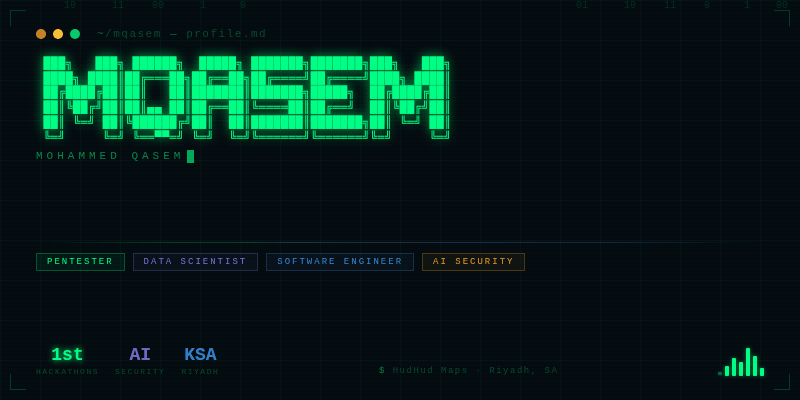

<div align="center">



</div>

---

```bash
$ whoami
> Mohammed Qasem — Software Engineer · Data Scientist · Pentester
> Location  : Riyadh, Saudi Arabia 🇸🇦
> Company   : HudHud Maps
> Focus     : AI Security · Red Teaming · POI Data Engineering
> Status    : [████████████░░░] Building...
```

---

### `// ARSENAL`

<div align="center">


</div>

---

### `// THREAT INTEL`

<div align="center">


</div>

---

### `// CURRENT OPS`

```python
class MQasem:
    role        = ["Software Engineer", "Data Scientist", "Pentester"]
    company     = "HudHud Maps 🗺️"
    focus_2025  = "AI Security & Red Teaming for AI Systems"

    current_ops = {
        "🔭 building"  : "geospatial data pipelines",
        "🛡️ exploring" : "AI red teaming & adversarial ML",
        "⚡ hacking"   : "Web vulnerability assessment & pen testing",
    }

    achievements = {
        "🏆 hackathons" : "Multiple 1st place finishes",
        "🌍 languages"  : ["Arabic", "English"],
    }
```

---

### `// SIGNAL`

<div align="center">

[](https://linkedin.com/in/mohammedcs)

</div>

<div align="center">

```
[ SYS ] ··· connection established ··· uptime: always ··· encryption: on ···
```

</div>
